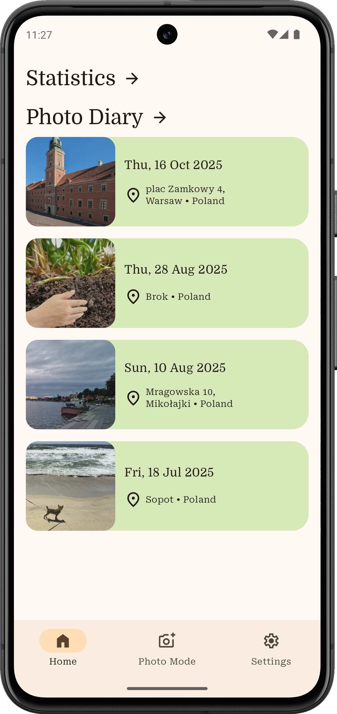
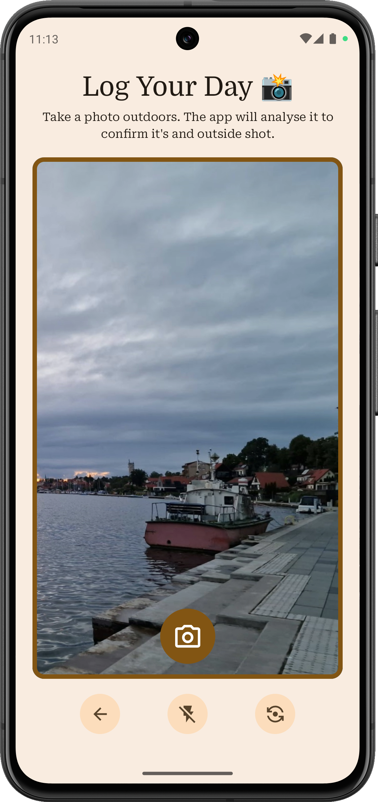
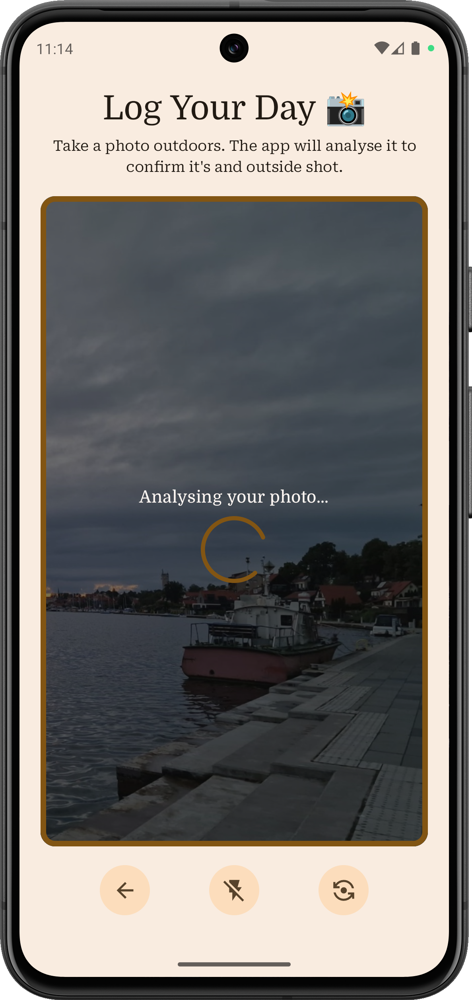
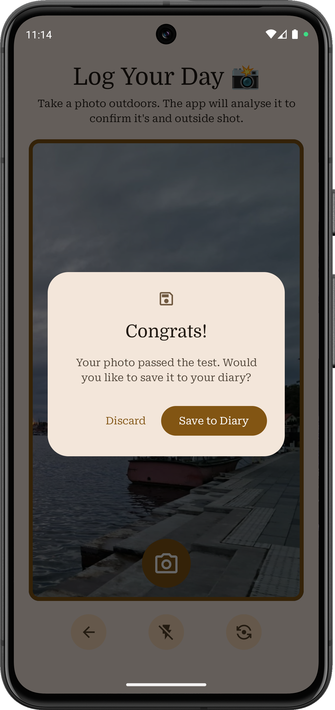

# GoOutside

GoOutside is an Android application helps you develop a habit of going outside by logging daily
entries.

Each day, you can take a photo, which is automatically analyzed by an on-device image classification
model. If the photo is recognized as taken outdoors, it can be added to the diary along with
location and date, creating an entry for your diary.

## Key Features

**Photo Validation**
Classifies photos using AI as indoor or outdoor to ensure only relevant entries are added to the
diary.

**Location Logging**
Captures the location when the photo is taken, including coordinates and basic address details.

**On-Device Processing**
The classification model runs locally, ensuring fast performance and privacy without relying on
external servers. That also means it works even if the device is offline.

## Technology Stack

- Kotlin + Jetpack Compose

- Dependency injection: Hilt

- Image classification:
  MLKit + [Custom TensforFlowLite model](https://github.com/Brydzzz/GoOutside-Model)

- Location Services: Android Geolocation
  and [GeoCoder](https://developer.android.com/reference/kotlin/android/location/Geocoder) APIs

- Storage: Local database using Room

## Roadmap

- Statistics for entries
- User settings
- Exporting and importing app database

## Screenshots

### Home Screen

### Photo Mode Screen

